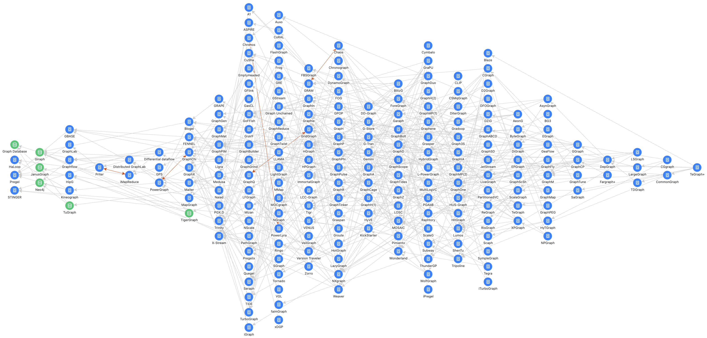

# Awesome-Graphs

🌐️ English | [中文](README.cn.md)

> Think Graphs Like A Graph.

## Introduction

**Awesome-Graphs** aims to collect papers and products related to graph computation systems and depict their derived relationships in a graph. It helps researchers and developers quickly familiarize themselves with the field of graph computation.

## Quick Start

Download and access the `index.html` file in your browser.

## Features

* Includes existing graph system papers/products, depicting their citation relationships in a graph.
* Perform citation chain analysis by searching/clicking on graph computation system node and distinguish between direct, indirect, and bidirectional citation relationships.
* Drag graph computation system node to view reference and citation relationships.
* Includes some graph computation system products, all mounted to the root node `Graph Database`.
* View the original paper or product websites of graph computation systems.
* Support upstream and downstream tracing and view direct neighbors.

## System List

All graph system papers/products are provided [**HERE**](docs/graph-system-list.md).

## Contributing

* The project only relies on the front-end component [vis.js](https://visjs.org/). To adjust the graph data, simply modify the definitions of `nodes` and `edges` in the `index.html` file.
* To add a new graph system paper node, for example, `{id: 'Pregel'},`.
  - Set `_paper` attribute as paper's title, for example, `{id: 'GeaFlow', _paper: 'GeaFlow: A Graph Extended and Accelerated Dataflow System'},`.
  - Set `_website` as relevant website, for example, `{id: 'TuGraph', _website: 'https://tugraph.tech'},`.
  - Set `_type: 'db'` indicates a product node, for example, `{id: 'TuGraph', _type: 'db'},`.
* To add citation of graph system papers/product, for example, `{from: 'GeaFlow', to: 'TuGraph'},`. 
  - Set `_bidirectional: true` indicates bidirectional citation, for example, `{from: 'GraphChi', to: 'PowerGraph', _bidirectional: true},` indicating `GraphChi` and `PowerGraph` cite each other (both presented at OSDI-2012).
* Add new paper to the path `papers/<GraphSystemName>.pdf` and update the reference links in `docs/graph-system-list.md` in alphabetical order.
* Due to manual organization, errors and omissions in the data are inevitable. Contributions for corrections and missing papers or product information are welcome.

## Contact Us

Join the [TuGraph](https://github.com/TuGraph-family) community to discuss and improve [Awesome-Graphs](https://github.com/TuGraph-family/Awesome-Graphs) together!

