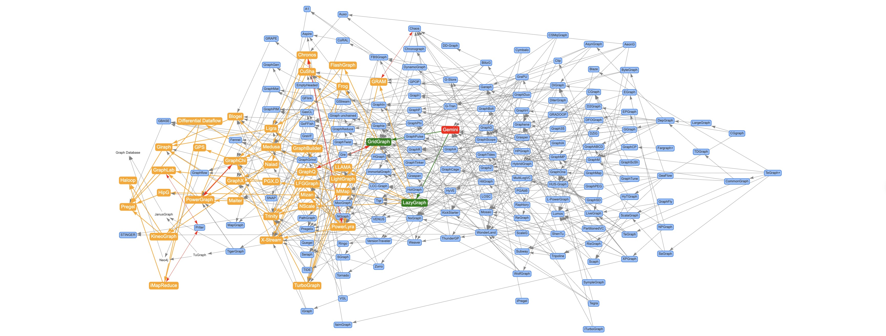

# Awesome-Graphs

🌐️ English | [中文](README.cn.md)

> Think Graphs Like A Graph.

## Introduction

**Awesome-Graphs** aims to collect papers and products related to graph computation systems and depict their derived relationships in a graph. It helps researchers and developers quickly familiarize themselves with the field of graph computation.

## Quick Start

Download and access the `index.html` file in your browser.

## Features

* Includes papers that cover over ten years of development in graph computation systems, depicting their citation relationships in a graph.
* Perform citation chain analysis by searching/clicking on graph computation system node and distinguish between direct, indirect, and bidirectional citation relationships.
* Drag graph computation system node to view reference and citation relationships.
* Includes some graph computation system products, all mounted to the root node `Graph Database`.
* View the original paper or product websites of graph computation systems. [In Development]
* More rich data and interactive forms. [In Development]

## Contributing

* The project only relies on the front-end component [vis.js](https://visjs.org/). To adjust the graph data, simply modify the definitions of `nodes` and `edges` in the `index.html` file.
* To add a new graph computation system product node, just mark the `_type` attribute as `db`, for example, `{id: 'TuGraph', label: 'TuGraph', color: 'white', _type: 'db'},`.
* For bidirectional citation graph computation system papers, add one edge and mark it as a red bidirectional arrow, for example, `{from:'GraphChi',to:'PowerGraph',color:'red',arrows:{to:{enabled:true,scaleFactor:1},from:{enabled:true,scaleFactor:1}}},` indicating `GraphChi` and `PowerGraph` cite each other (both presented at OSDI-2012).
* Due to manual organization, errors and omissions in the data are inevitable. Contributions for corrections and missing papers or product information are welcome.

## Contact Us

Join the [TuGraph](https://github.com/TuGraph-family) community to discuss and improve [Awesome-Graphs](https://github.com/TuGraph-family/Awesome-Graphs) together!

